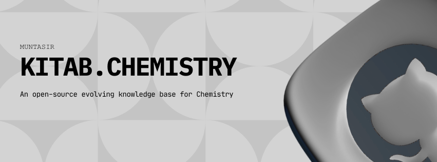

# Kitab.Math

Welcome to **Kitab.Math**, your companion in exploring the language of the universe.

---

## 📖 What is Kitab.Math?

Kitab.Math is a **community-powered library** designed to make mathematics accessible to everyone.  
We gather the best concepts, formulas, and proofs from across the world of mathematics into one simple, searchable place.

---

## 🌍 Our Vision

We believe that understanding the universe should be an **open door for everyone**.  
Whether you are just starting your journey into algebra or looking for deep dives into topology or number theory, Kitab.Math is here to help you grow and share your knowledge with fellow explorers around the world.

---

🔗 Visit [Kitab.Math](https://math.muntasir.site)

